# 🚀 MADAR — Application Modernization with Containers

### 🧭 Phase 05 of the MADAR Cloud Transformation

    

> 🟠 **BUILD & VALIDATION COMPLETE — CLEANUP NEXT.** The same MADAR workload previously migrated in Phase 03 has now been recovered, containerized, restored onto a private PostgreSQL data layer, deployed behind an ALB on ECS Fargate, and tested for self-healing, automatic scale-out, database dependency failure/recovery and observability.

---

## 🎯 Mission

Phase 05 moves MADAR from **“the application lives inside a VM”** to **“the application is a portable, stateless container workload.”** The focus is runtime modernization and operational behavior—not CI/CD, Kubernetes or IaC.

```text
🖥️ Phase 03 retained AMI / snapshot
        ↓
🔎 Recover Flask source + PostgreSQL dump
        ↓
🐳 Docker + Gunicorn + non-root runtime
        ↓
📦 Amazon ECR
        ↓
🚀 ECS Service / AWS Fargate
        ↓
⚖️ Application Load Balancer
        ↓
🐘 Private Amazon RDS PostgreSQL
```

---

## 🏗️ Validated Architecture

```text
                              🌍 INTERNET
                                   │
                              HTTP :80
                                   ▼
                         ┌──────────────────┐
                         │ ⚖️ Public ALB    │
                         │ Public-A / B     │
                         └────────┬─────────┘
                                  │ :8080
                                  ▼
                         ┌──────────────────┐
                         │ 🚀 ECS Fargate   │
                         │ 256 CPU / 512 MB │
                         │ public IPv4      │
                         └────────┬─────────┘
                                  │ :5432
                                  ▼
                         ┌──────────────────┐
                         │ 🐘 RDS PostgreSQL│
                         │ Private subnets  │
                         │ db.t4g.micro     │
                         │ Single-AZ        │
                         └──────────────────┘

📦 ECR → images          🔐 Secrets Manager → DB credentials
📊 CloudWatch → telemetry 🛡️ SG chain → ALB → ECS → RDS
```

### 🌐 Network

| Layer | Resource | Configuration |
|---|---|---|
| VPC | `MADAR-P05-VPC` | `10.60.0.0/16` |
| Public-A | `subnet-024a57f44c014ab2a` | `10.60.1.0/24` · us-east-1a |
| Public-B | `subnet-0726ef657d0ab0ca5` | `10.60.2.0/24` · us-east-1b |
| Private-A | `subnet-0ba1f1f304eec85cb` | `10.60.11.0/24` · us-east-1a |
| Private-B | `subnet-0395c2043842856ce` | `10.60.12.0/24` · us-east-1b |
| IGW | `igw-0df8ed399478fa879` | public egress/ingress path |
| Private routing | `rtb-0ed3daeca13e9987e` | local only / no NAT |

<p align="center">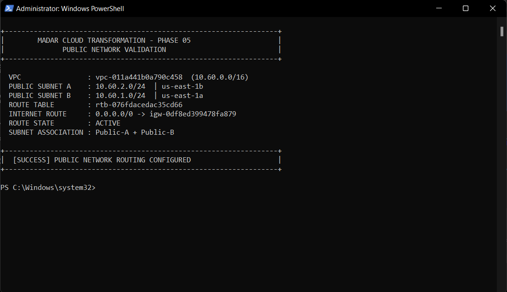</p>

---

## 🛡️ Security Boundary

```text
🌍 0.0.0.0/0
      │ TCP 80
      ▼
🛡️ ALB-SG  sg-00b9b70e13293ff46
      │ TCP 8080
      ▼
🛡️ ECS-SG  sg-0d13f6af551e284c8
      │ TCP 5432
      ▼
🛡️ RDS-SG  sg-00ae439cb916d164b
```

- ALB is the only Internet-facing application entry point.
- ECS accepts application ingress only from the ALB security group.
- RDS accepts PostgreSQL only from the ECS security group.
- RDS is not publicly accessible.
- No NAT Gateway was used in this cost-controlled lab.

<p align="center">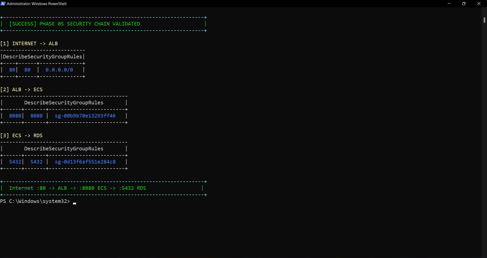</p>

---

## 🐳 Container Modernization

The recovered Flask application was cleaned of VM-specific database assumptions and packaged with `python:3.12-slim`, Gunicorn, pinned dependencies, a dedicated non-root `madar` user, stdout/stderr logging and external `MADAR_DB_*` configuration.

```text
/api/health → process/application liveness
/api/ready  → PostgreSQL dependency readiness
```

<table><tr>
<td width="50%" align="center"><b>🐳 Docker build</b><br><br>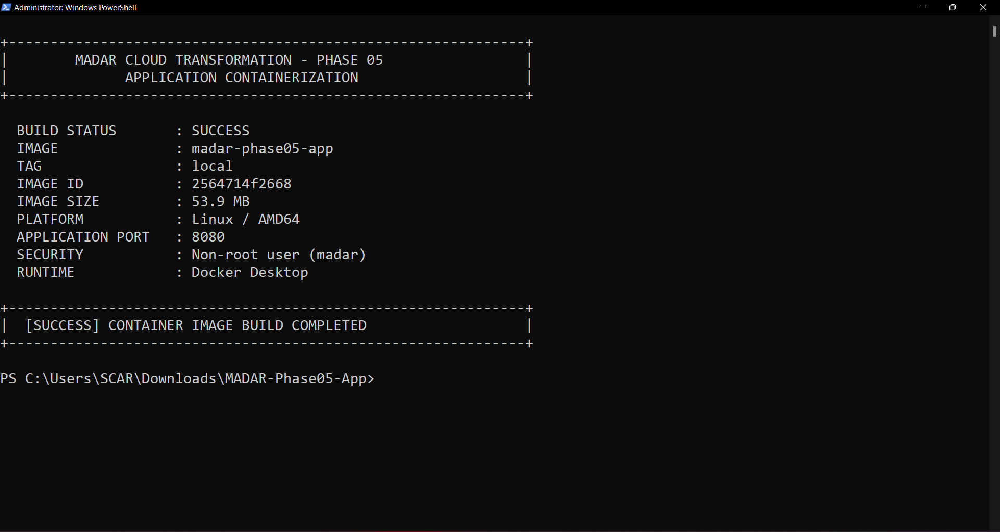</td>
<td width="50%" align="center"><b>❤️ Local health validation</b><br><br>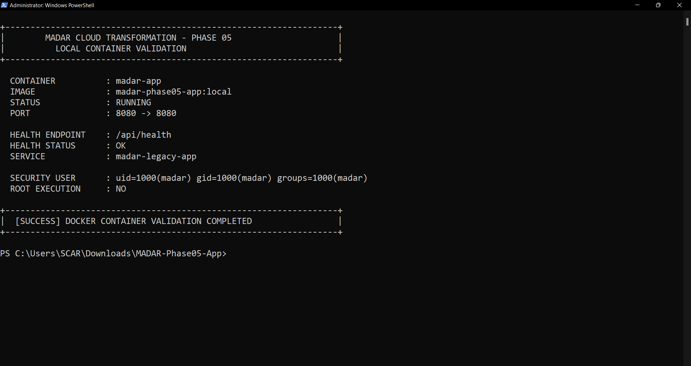</td>
</tr></table>

Application image:

```text
Repository  madar-phase05-app
Tag         v1
Digest      sha256:2564714f2668c95ab89c81e95e438a63d14c9d66194ea7eda6a34df59ab99346
```

---

## 🗃️ Legacy Database Recovery & Controlled Restore

A key Phase 05 discovery was that the retained S3 operational data did **not** contain the full PostgreSQL dump needed to recreate the legacy database. The retained Phase 03 EBS snapshot was inspected read-only using temporary infrastructure. The newer authoritative PostgreSQL custom dump was recovered and copied to:

```text
s3://madar-operational-files-197821101770/database-backups/madar_legacy_final.dump
```

A purpose-built restore container was published to `madar-p05-restore:v1`. Its task role could read **only that exact S3 object**. The one-off Fargate restore task exited `0` and CloudWatch logged `RESTORE COMPLETED SUCCESSFULLY`; a separate DB verification task also exited `0`.

<table><tr>
<td width="50%" align="center"><b>🗃️ Legacy dump recovered</b><br><br>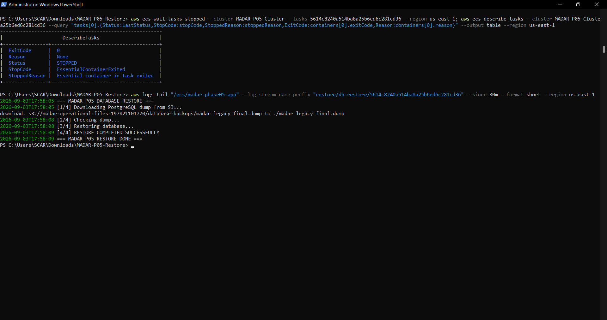</td>
<td width="50%" align="center"><b>🧪 Restore image QA</b><br><br>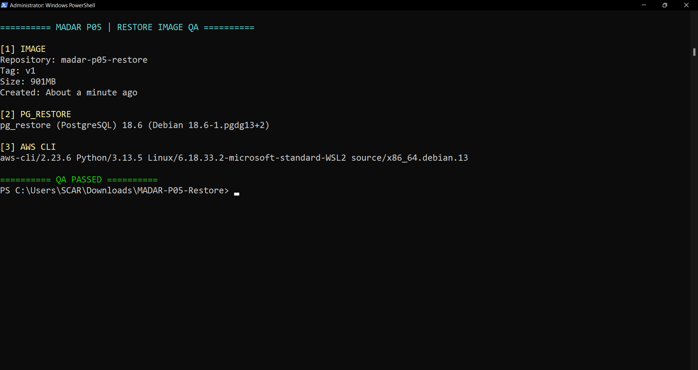</td>
</tr><tr>
<td width="50%" align="center"><b>📦 Restore repository</b><br><br>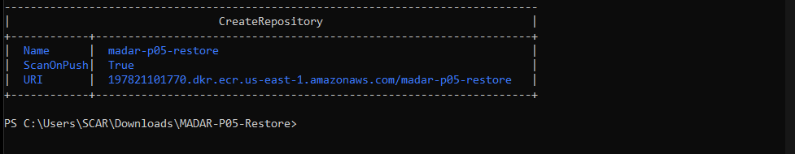</td>
<td width="50%" align="center"><b>📤 Restore image pushed</b><br><br>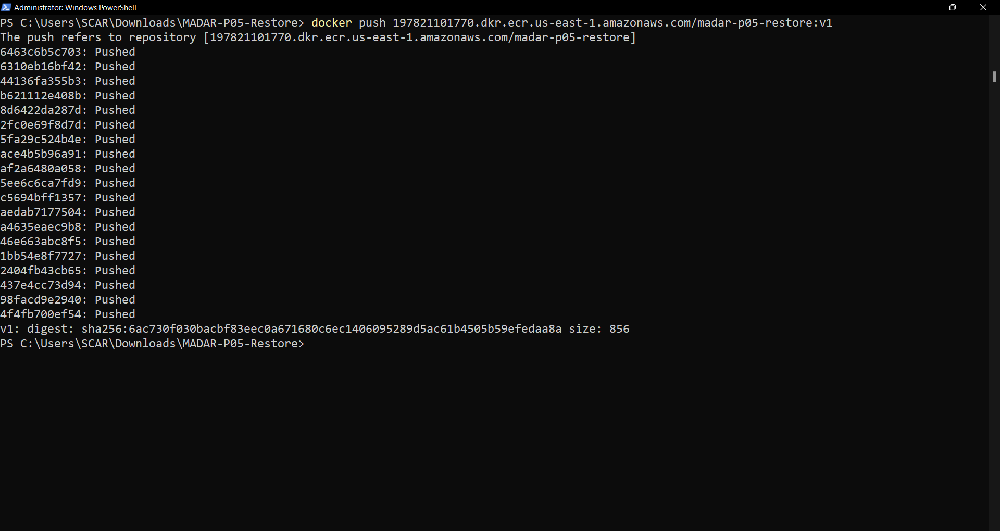</td>
</tr></table>

Temporary snapshot-inspection EC2/EBS/SG resources were deleted after recovery. The original retained Phase 03 snapshot remains intentionally preserved.

---

## 🚀 ECS Fargate + ALB — End-to-End Success

```text
Cluster       MADAR-P05-Cluster
Service       MADAR-P05-App-Service
Task def      madar-phase05-app:1
ALB           MADAR-P05-ALB
Target group  MADAR-P05-TG / target type ip
Health path   /api/health
```

Validated through the ALB:

```text
/api/health → HTTP 200
/api/ready  → HTTP 200 / database connected
Dashboard   → rendered successfully
```

<table><tr>
<td width="50%" align="center"><b>🚀 Fargate running</b><br><br>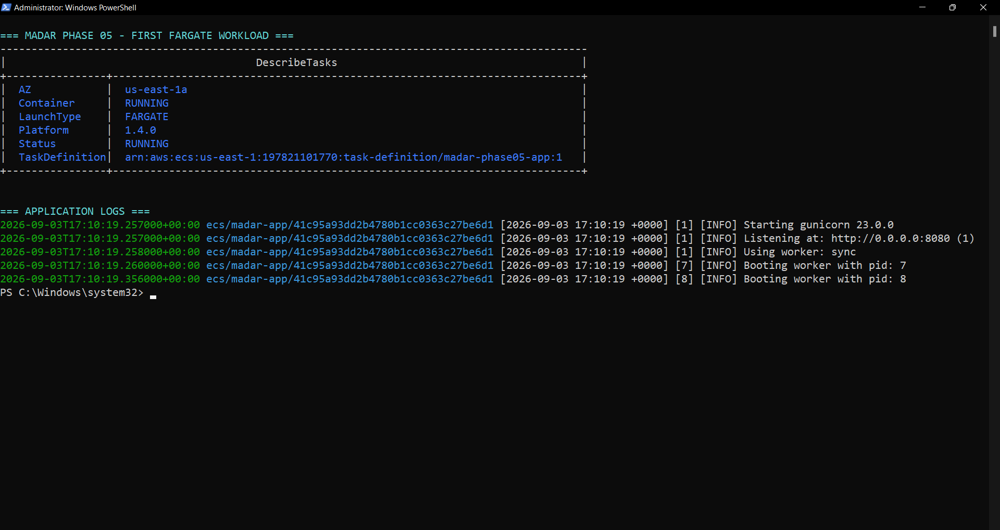</td>
<td width="50%" align="center"><b>⚖️ Healthy ALB target</b><br><br>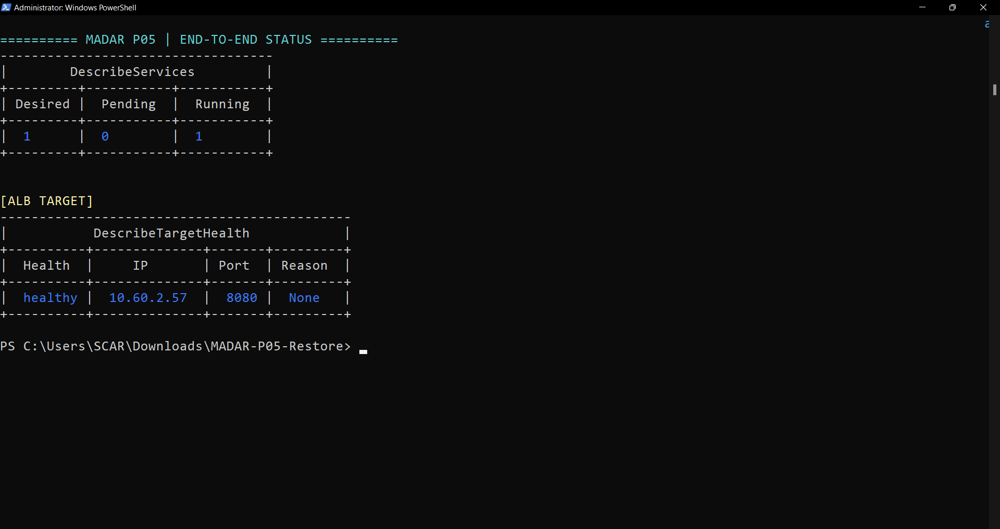</td>
</tr><tr>
<td width="50%" align="center"><b>🩺 Database API validation</b><br><br>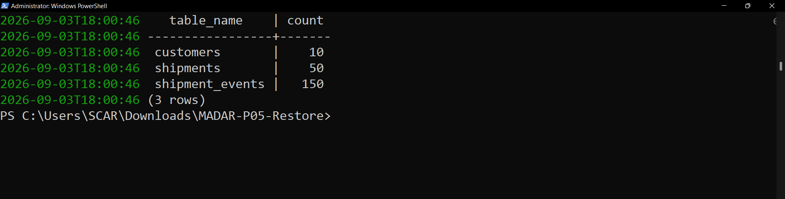</td>
<td width="50%" align="center"><b>📊 MADAR dashboard on Fargate</b><br><br>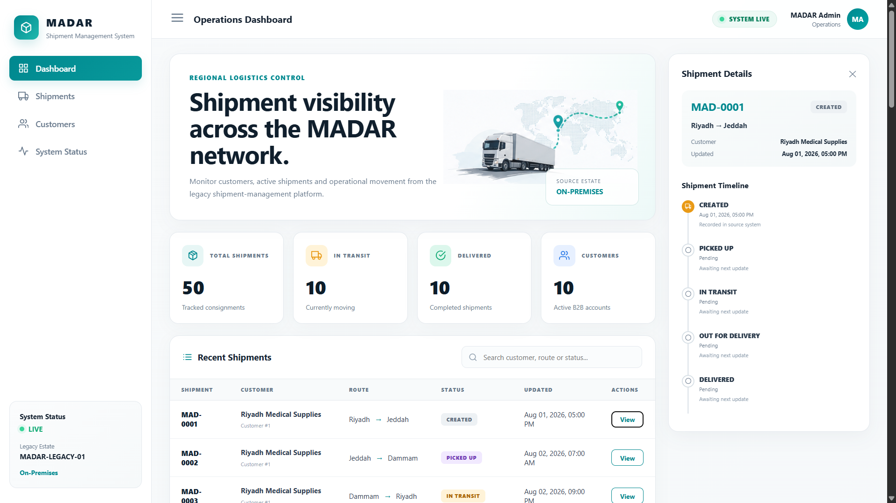</td>
</tr></table>

---

## ♻️ Self-Healing Test — PASS

Desired count was temporarily raised to `2`. Two targets became healthy. One service task was intentionally stopped; ECS detected the desired/running mismatch, started a replacement, ALB drained the old target, and the application remained available through the surviving target. The service returned to desired healthy capacity.

<table><tr>
<td width="33%" align="center"><b>2️⃣ Two healthy targets</b><br><br>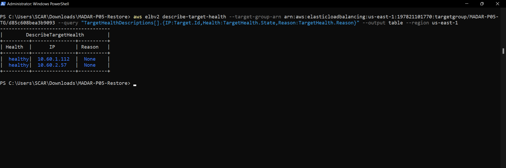</td>
<td width="33%" align="center"><b>💥 Failure injected</b><br><br>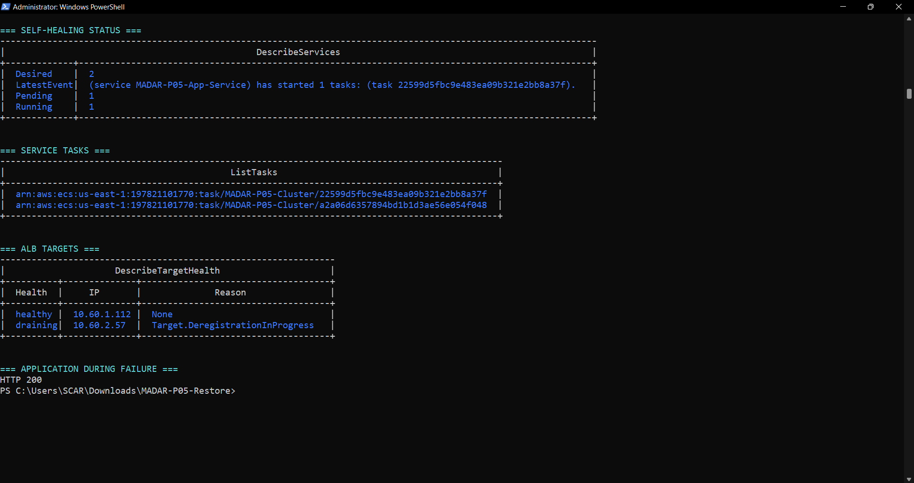</td>
<td width="33%" align="center"><b>♻️ Recovered</b><br><br>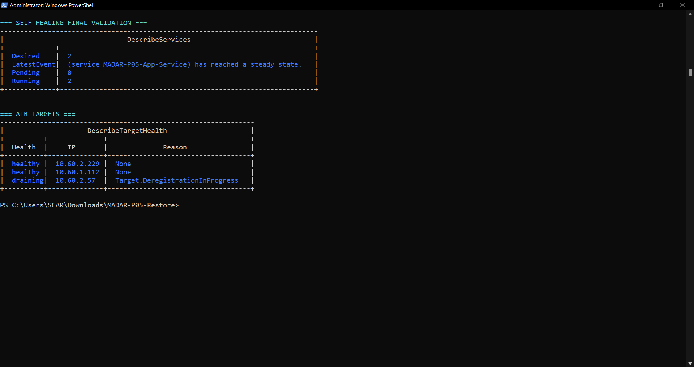</td>
</tr></table>

---

## 📈 Target-Tracking Auto Scaling — PASS

Final policy:

```text
MinCapacity       1
MaxCapacity       2
Metric            ECSServiceAverageCPUUtilization
TargetValue       40%
Cooldowns         60s / 60s
```

For a controlled lab test only, the target was temporarily lowered to `5%`. Load drove service CPU above that threshold for the required evaluation periods. CloudWatch entered `ALARM`, triggered `MADAR-P05-CPU-TargetTracking`, and ECS automatically changed desired count from `1 → 2`. The target was restored to `40%` immediately afterward.

<p align="center">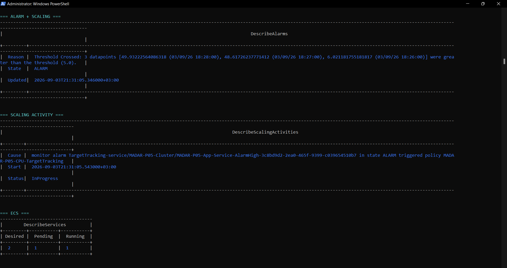</p>

> **Claim boundary:** automatic **scale-out** is validated. This project does not claim a separately evidenced automatic scale-in event.

---

## 🔌 RDS Dependency Failure & Recovery — PASS

Failure injection was performed by temporarily revoking the exact `ECS-SG → RDS-SG :5432` rule.

```text
Normal            health 200 / ready 200
5432 revoked      health 200 / ready 502 observed through ALB
5432 restored     health 200 / ready 200
```

The result demonstrates that the application process remained alive while its database-backed readiness path failed, then recovered after the dependency path was restored.

<table><tr>
<td width="50%" align="center"><b>🔌 Dependency failure</b><br><br>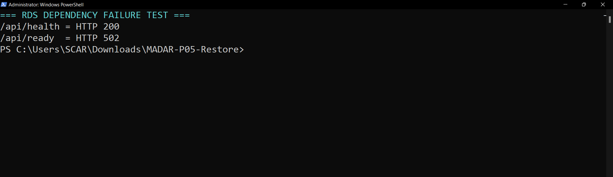</td>
<td width="50%" align="center"><b>✅ Dependency recovery</b><br><br>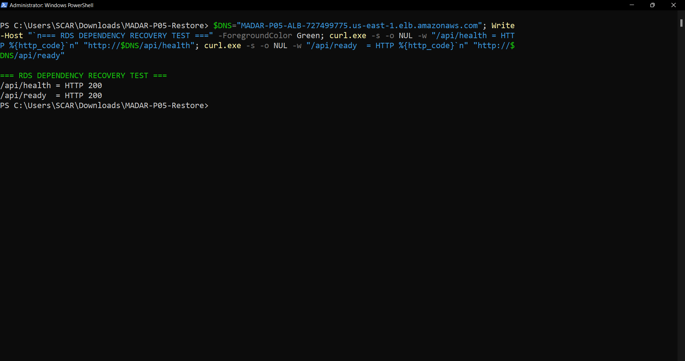</td>
</tr></table>

---

## 📊 Observability

Validation captured infrastructure state and telemetry across the stack: ECS CPU/memory and service state, ALB target health/request volume, RDS availability/connections and CloudWatch log streams.

<table><tr>
<td width="50%" align="center"><b>🩺 Infrastructure health</b><br><br>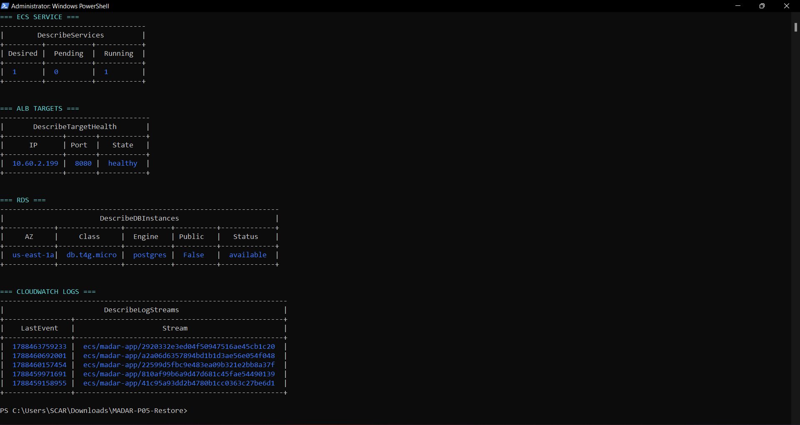</td>
<td width="50%" align="center"><b>📈 CloudWatch metrics</b><br><br>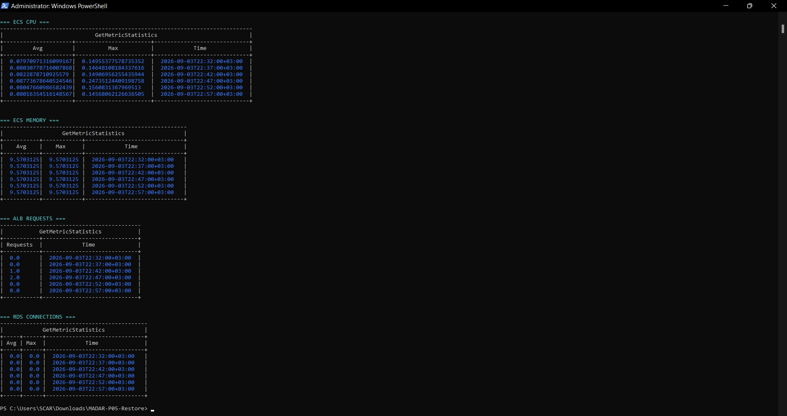</td>
</tr></table>

---

## 💰 Cost-Conscious Engineering

This lab deliberately avoided NAT Gateway, EKS, Multi-AZ RDS, WAF, Route 53/custom domain, Terraform and CI/CD. RDS/ALB/Fargate were kept only for the validation window.

The pre-cleanup Cost Explorer checkpoint showed negligible values / approximately `$0.00` visible for the captured period. Cost Explorer can lag, so this is documented as a checkpoint—not a final settled-cost guarantee.

<p align="center">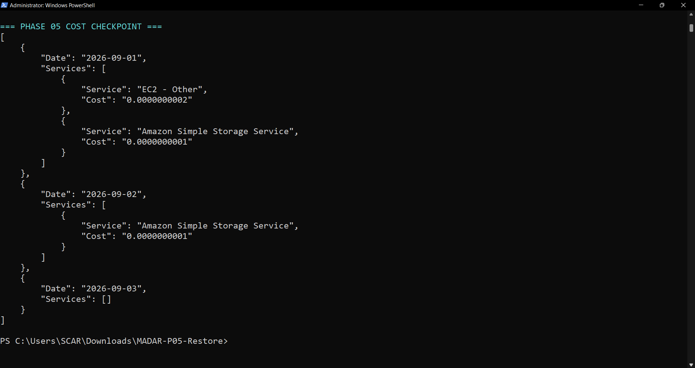</p>

---

## 🧠 Architecture Decisions

### 🌍 Public Fargate for a short-lived lab
Public IPv4 on Fargate avoids NAT Gateway cost/complexity while the ECS SG still blocks direct application ingress. Production extension: private tasks with controlled egress/VPC endpoints.

➡️ [`ADR-001`](decisions/ADR-001-public-fargate-for-short-lived-lab.md)

### 🔓 HTTP for temporary validation
The short-lived ALB uses HTTP `:80`. Production extension: ACM + HTTPS + HTTP→HTTPS redirect.

➡️ [`ADR-002`](decisions/ADR-002-http-lab-production-tls.md)

### 🔐 Externalized credentials
Database credentials are stored in Secrets Manager rather than source code or image layers. Restore access to S3 used a separate least-privilege task role.

### ❤️ Separate liveness from readiness
ALB liveness checks `/api/health`; database dependency behavior is tested through `/api/ready`. This prevents a database outage from being misrepresented as a dead application process.

---

## 🚦 Project Progress

| Workstream | Status |
|---|---|
| Gate 0 / retained artifacts | ✅ PASS |
| Legacy source recovery | ✅ DONE |
| Docker modernization | ✅ DONE |
| ECR application image | ✅ DONE |
| VPC / security / private RDS | ✅ DONE |
| Legacy DB dump recovery + restore | ✅ DONE |
| ECS Fargate + ALB | ✅ DONE |
| End-to-end application/database | ✅ PASS |
| Self-healing | ✅ PASS |
| Target-tracking scale-out | ✅ PASS |
| RDS dependency failure/recovery | ✅ PASS |
| Observability | ✅ DONE |
| Cost checkpoint | ✅ DONE |
| Destructive cleanup | ▶️ NEXT |
| Residual audit | ⏳ PENDING |

---

## 📸 Evidence

All evidence lives in one flat `evidence/` directory. See the complete claim-by-claim index in [`evidence/README.md`](evidence/README.md).

The only remaining evidence expected for final closeout is:

```text
phase05-final-cleanup.png
phase05-residual-audit.png
```

---

## 📚 Repository Guide

```text
📦 MADAR-application-modernization-containers/
├── 🚀 README.md
├── 📍 CURRENT-STATE.md
├── 🎯 REPOSITORY-SCOPE.md
├── 🧭 START-HERE-TOMORROW.md
├── ✅ checklists/
├── 🧠 decisions/
├── 📚 docs/
├── 📸 evidence/
└── 🧰 runbooks/
```

📋 [`Frozen implementation plan`](docs/PHASE-05-FROZEN-IMPLEMENTATION-PLAN.md)  
🧰 [`Execution record`](runbooks/00-execution-runbook.md)  
🧹 [`Cleanup runbook`](runbooks/99-cleanup-runbook.md)

---

## 🔗 MADAR Transformation Continuity

```text
Phase 01 ✅ Foundation
Phase 02 ✅ Platform/network evolution
Phase 03 ✅ Legacy workload migration to AWS
Phase 04 ✅ Hybrid identity & workforce access
Phase 05 🟠 Application modernization validated — cleanup next
```

Phase 05 deliberately preserves the business workload while changing **how it runs**: from a VM-bound Flask application to an observable, load-balanced, self-healing and scalable container service.

---

## 🏁 Definition of Done

Technical validation is complete. Phase 05 will be marked fully complete only after the cleanup runbook removes Phase 05 resources, a residual audit proves no unexpected resources remain, and final closeout documentation is synchronized.
