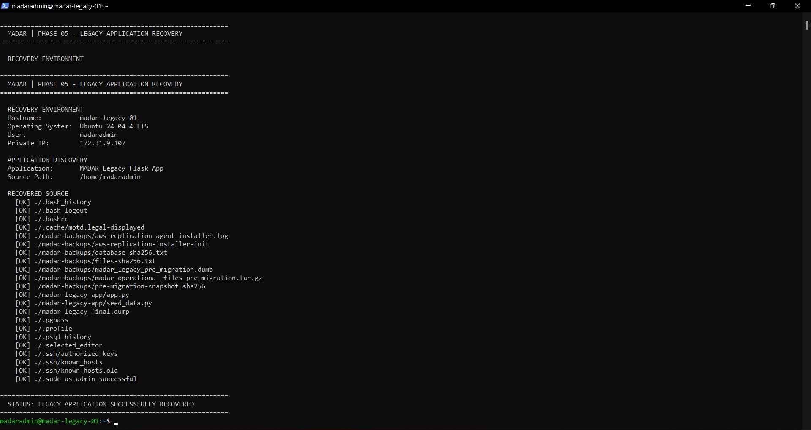
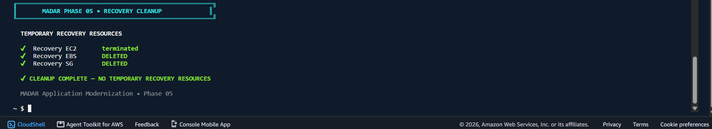
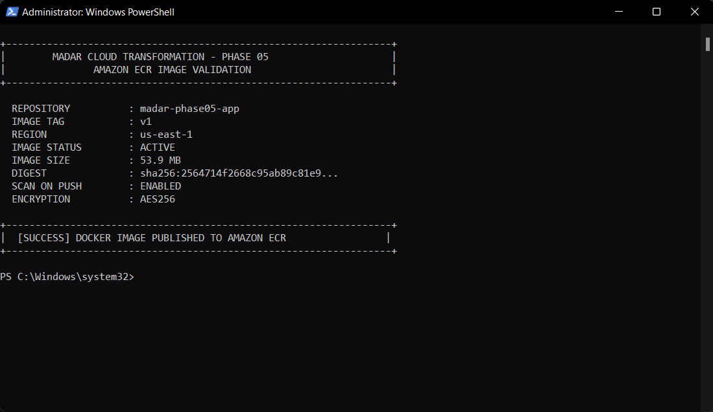
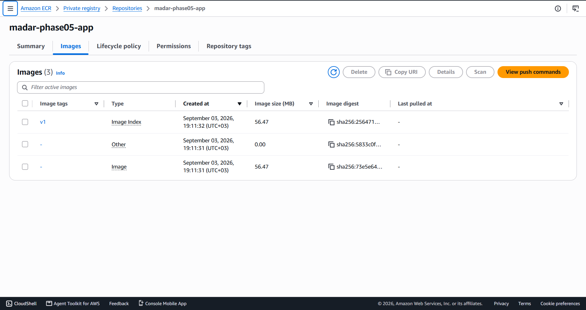

# 🚀 MADAR — Application Modernization with Containers

### 🧭 Phase 05 of the MADAR Cloud Transformation

    

> 🟢 **LIVE BUILD IN PROGRESS** — Gate 0 passed, the legacy Flask application was recovered from the retained Phase 03 AMI, modernized into a non-root Docker image, validated locally, published to Amazon ECR, and the Phase 05 network/security/private PostgreSQL foundation is now live. IAM/ECS foundation is the current workstream.

---

## 🎯 Mission

Phase 05 modernizes the **same MADAR legacy workload** previously migrated in Phase 03. The engineering goal is to separate the Flask application from its VM/operating-system runtime and move it into a portable, stateless container architecture on **Amazon ECS with AWS Fargate**.

```text
🖥️ Retained Phase 03 AMI
        ↓
🔎 Temporary Recovery EC2
        ↓
🐍 Existing Flask Application
        ↓
🐳 Docker + Gunicorn + non-root runtime
        ↓
📦 Amazon ECR : v1
        ↓
🚀 Amazon ECS / AWS Fargate        ← CURRENT BUILD AREA
        ↓
⚖️ Application Load Balancer
        ↓
🐘 Private Amazon RDS PostgreSQL
```

---

## 🏗️ Target Architecture

```text
                              🌍 INTERNET
                                   │
                              HTTP :80
                                   ▼
                         ┌──────────────────┐
                         │ ⚖️ Public ALB    │
                         │ Public-A / B     │
                         └────────┬─────────┘
                                  │ :8080
                                  ▼
                         ┌──────────────────┐
                         │ 🚀 ECS Fargate   │
                         │ 256 CPU / 512 MB │
                         │ public IPv4      │
                         └────────┬─────────┘
                                  │ :5432
                                  ▼
                         ┌──────────────────┐
                         │ 🐘 RDS PostgreSQL│
                         │ Private subnet   │
                         │ db.t4g.micro     │
                         │ Single-AZ        │
                         └──────────────────┘

📦 ECR → container image     🔐 Secrets Manager → DB credentials
📊 CloudWatch → logs/metrics 🛡️ SG chain → ALB → ECS → RDS
```

### 🌐 Live network

| Layer | Resource | Configuration | State |
|---|---|---|---|
| 🏠 VPC | `MADAR-P05-VPC` | `10.60.0.0/16` | ✅ |
| 🌍 Public-A | `subnet-024a57f44c014ab2a` | `10.60.1.0/24` · us-east-1a | ✅ |
| 🌍 Public-B | `subnet-0726ef657d0ab0ca5` | `10.60.2.0/24` · us-east-1b | ✅ |
| 🔒 Private-A | `subnet-0ba1f1f304eec85cb` | `10.60.11.0/24` · us-east-1a | ✅ |
| 🔒 Private-B | `subnet-0395c2043842856ce` | `10.60.12.0/24` · us-east-1b | ✅ |
| 🚪 IGW | `igw-0df8ed399478fa879` | attached to Phase 05 VPC | ✅ |
| 🛣️ Public RT | `rtb-076fdacedac35cd66` | `0.0.0.0/0 → IGW` | ✅ |
| 🔐 Private RT | `rtb-0ed3daeca13e9987e` | local route only | ✅ |

<p align="center">
  
</p>

> 🧠 **Routing decides where traffic can go. Security Groups decide who may talk to whom and on which port.**

---

## 🛡️ Security Chain

```text
🌍 0.0.0.0/0
      │ TCP 80
      ▼
🛡️ ALB-SG  sg-00b9b70e13293ff46
      │ TCP 8080
      ▼
🛡️ ECS-SG  sg-0d13f6af551e284c8
      │ TCP 5432
      ▼
🛡️ RDS-SG  sg-00ae439cb916d164b
```

✅ ALB is the only Internet-facing application entry point.  
✅ ECS application ingress is allowed only from `ALB-SG`.  
✅ PostgreSQL ingress is allowed only from `ECS-SG`.  
✅ RDS is not publicly accessible.  
✅ No NAT Gateway is used in this cost-controlled lab.

<p align="center">
  
</p>

---

## 🔎 Legacy Recovery — Completed

The retained Phase 03 AMI was used only as a temporary recovery source to locate and safely extract the existing Flask workload. Recovery compute was then removed.

<table>
<tr>
<td width="50%" align="center"><b>🔎 Legacy application discovered</b><br><br></td>
<td width="50%" align="center"><b>🧹 Recovery resources cleaned</b><br><br></td>
</tr>
</table>

---

## 🐳 Container Modernization — Completed

The recovered Flask application was cleaned of VM-specific database assumptions and packaged using:

- 🐍 `python:3.12-slim`
- 🔫 Gunicorn with 2 workers
- 👤 dedicated non-root `madar` user
- 📌 pinned Python dependencies
- 🧹 `.dockerignore`
- 🔐 external database configuration
- 📤 stdout/stderr logging
- ❤️ `/api/health` for liveness
- 🩺 `/api/ready` for database/dependency readiness

Local validation proved:

```text
🐳 docker build             ✅
🚀 container starts         ✅
❤️ /api/health → 200        ✅
🩺 /api/ready → 503 locally ✅ expected without PostgreSQL
👤 non-root UID 1000        ✅
```

<table>
<tr>
<td width="50%" align="center"><b>🐳 Docker build success</b><br><br></td>
<td width="50%" align="center"><b>❤️ Container health validation</b><br><br></td>
</tr>
</table>

The liveness/readiness split is intentional: a database outage should not cause ECS to continuously replace otherwise healthy application containers.

---

## 📦 Amazon ECR — Completed

```text
Repository : madar-phase05-app
Image tag  : v1
Region     : us-east-1
Digest     : sha256:2564714f2668c95ab89c81e95e438a63d14c9d66194ea7eda6a34df59ab99346
Scan push  : enabled
Encryption : AES256
```

The image is now stored in AWS and can be pulled directly by ECS/Fargate; the local Docker runtime is no longer required for deployment.

<table>
<tr>
<td width="50%" align="center"><b>📤 ECR push success</b><br><br></td>
<td width="50%" align="center"><b>🏷️ ECR v1 verified</b><br><br></td>
</tr>
</table>

---

## 🐘 Private PostgreSQL — Live

```text
Identifier           madar-p05-postgres
Engine               PostgreSQL 18.3
Database             madar_legacy
Class                db.t4g.micro
Storage              20 GB gp3
Deployment           Single-AZ
Availability Zone    us-east-1a
Publicly accessible  false 🔒
Security Group       MADAR-P05-RDS-SG
Status               available ✅
```

🔐 Database connection data is externalized in **AWS Secrets Manager** under `MADAR/Phase05/Postgres`; no password is committed to this repository or embedded in the container image.

> ⚠️ Lab note: this temporary RDS instance currently reports storage encryption disabled. A production deployment should enable encryption at rest. The lab remains intentionally short-lived and will be destroyed after evidence collection.

---

## 🔑 IAM / ECS Foundation — Current Step

Created:

```text
MADAR-P05-ECS-ExecutionRole ✅
Trust principal: ecs-tasks.amazonaws.com
```

Next, the role receives only the permissions required for ECR image pull, CloudWatch log delivery and injection of the specific Phase 05 database secret. Application runtime permissions remain separate through the ECS Task Role.

```text
Execution Role 🏗️ → infrastructure needs
Task Role       🧑‍💻 → application AWS API needs
```

---

## 🚦 Implementation Progress

| Gate | Workstream | Status |
|---|---|---|
| 🟢 0 | Account / credits / retained artifacts | ✅ PASS |
| 🟢 1 | Legacy AMI recovery & safe source extraction | ✅ DONE |
| 🟢 2 | Local Docker build & validation | ✅ DONE |
| 🟢 3 | ECR repository + `v1` image publication | ✅ DONE |
| 🟡 4 | VPC / RDS / Secrets / IAM / ECS foundation | 🔄 IN PROGRESS |
| ⚪ 5 | ECS Service + ALB functional validation | ⏳ TODO |
| ⚪ 6 | HA / self-healing / auto scaling | ⏳ TODO |
| ⚪ 7 | Dependency failure + observability + cost evidence | ⏳ TODO |
| ⚪ 8 | Destructive cleanup + residual audit | ⏳ TODO |

---

## 🧪 Tests Still Required Before Completion

```text
🚀 Initial Fargate task reaches RUNNING
📦 ECR image pull succeeds
📊 Container logs arrive in CloudWatch
🐘 ECS → RDS connectivity succeeds
🗃️ Schema/test data initialized
⚖️ ALB target becomes healthy
❤️ /api/health works through ALB
🩺 DB-backed endpoint returns expected data
2️⃣ desiredCount=2 produces two healthy targets
💥 stop one task → ECS replaces it
📈 controlled load → scale out → scale in
🔌 revoke ECS→RDS :5432 → dependency fails
🔧 restore :5432 → application recovers
💰 cost checkpoint captured
🧹 all temporary Phase 05 infrastructure removed
🔍 residual-resource audit passes
```

---

## 💰 Cost-Conscious Engineering

This lab intentionally avoids unnecessary persistent infrastructure:

- 🚫 no NAT Gateway
- 🚫 no EKS
- 🚫 no Multi-AZ RDS
- 🚫 no custom domain / Route 53
- 🚫 no WAF
- 🚫 no CI/CD in this phase
- 🚫 no Terraform in this phase
- ⏱️ RDS, ALB and Fargate exist only for the validation window

The account preflight passed under the existing AWS Free Plan/credit environment; **no account upgrade was performed or required for this build path**.

---

## 🧠 Key Architecture Decisions

### 🌍 Public Fargate for this short-lived lab
Fargate tasks will receive public IPv4 addresses so they can pull from ECR and deliver logs without a NAT Gateway. Direct application ingress is still blocked because `ECS-SG` accepts port `8080` only from `ALB-SG`.

➡️ See [`ADR-001`](decisions/ADR-001-public-fargate-for-short-lived-lab.md).

### 🔓 HTTP for temporary validation
The temporary ALB uses HTTP `:80`. A production extension would use ACM + HTTPS and redirect HTTP to HTTPS.

➡️ See [`ADR-002`](decisions/ADR-002-http-lab-production-tls.md).

### 🔐 Secrets instead of hardcoded credentials
Database credentials live outside source and container layers. ECS will receive the required values through controlled IAM-backed secret injection.

---

## 📸 Evidence Gallery

> Every image below is committed under `evidence/` and supports a concrete engineering claim.

<table>
<tr>
<td width="50%" align="center"><b>🔎 Recovery</b><br><br></td>
<td width="50%" align="center"><b>🧹 Recovery Cleanup</b><br><br></td>
</tr>
<tr>
<td width="50%" align="center"><b>🐳 Docker Build</b><br><br></td>
<td width="50%" align="center"><b>❤️ Container Health</b><br><br></td>
</tr>
<tr>
<td width="50%" align="center"><b>📦 ECR Push</b><br><br></td>
<td width="50%" align="center"><b>🏷️ ECR v1</b><br><br></td>
</tr>
<tr>
<td width="50%" align="center"><b>🌐 Network Routing</b><br><br></td>
<td width="50%" align="center"><b>🛡️ Security Chain</b><br><br></td>
</tr>
</table>

➡️ Full evidence roadmap: [`evidence/README.md`](evidence/README.md)

---

## 📚 Repository Guide

```text
📦 MADAR-application-modernization-containers/
├── 🚀 README.md
├── 📍 CURRENT-STATE.md
├── 🎯 REPOSITORY-SCOPE.md
├── 🚦 START-HERE-TOMORROW.md
├── ✅ checklists/
├── 🧠 decisions/
├── 📚 docs/
├── 📸 evidence/
└── 🧰 runbooks/
```

📋 Detailed implementation sequence: [`docs/PHASE-05-FROZEN-IMPLEMENTATION-PLAN.md`](docs/PHASE-05-FROZEN-IMPLEMENTATION-PLAN.md)  
🧰 Operational commands: [`runbooks/00-execution-runbook.md`](runbooks/00-execution-runbook.md)  
🧹 Cleanup: [`runbooks/99-cleanup-runbook.md`](runbooks/99-cleanup-runbook.md)

---

## 🔗 MADAR Transformation Continuity

```text
Phase 01 ✅
Phase 02 ✅
Phase 03 ✅ Legacy workload migrated to AWS
Phase 04 ✅ Hybrid identity & workforce access
Phase 05 🔄 Application modernization with containers
```

Phase 05 is not a disconnected demo. It takes the workload recovered from the Phase 03 migration story and evolves its runtime toward managed, portable container operations.

### 🏁 Definition of Done

> Phase 05 is complete only when the application works through the ALB, the database path is proven, self-healing/scaling/failure behavior is demonstrated with evidence, costs are captured, and all temporary infrastructure is cleaned up and audited.
