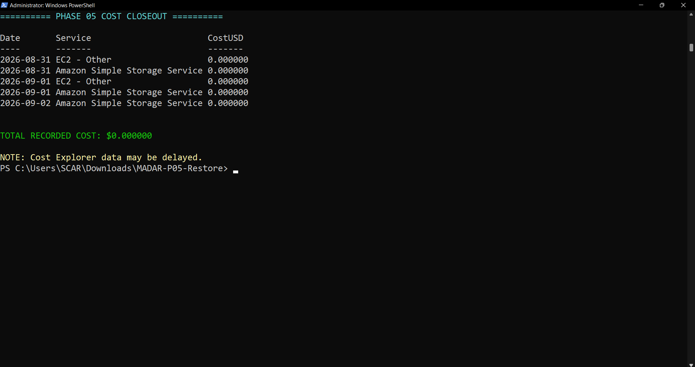
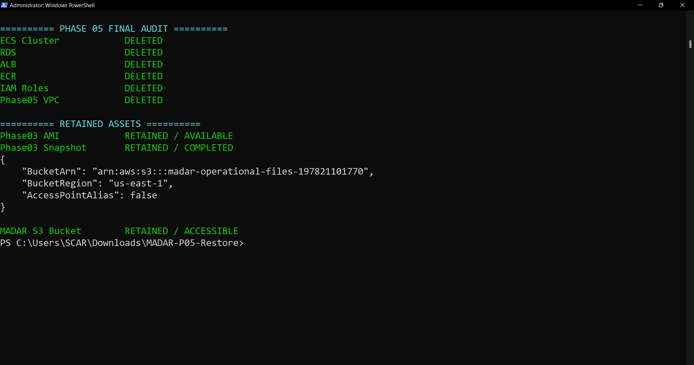

# 🚀 MADAR — Application Modernization with Containers

### 🧭 Phase 05 of the MADAR Cloud Transformation

    

> 🟢 **COMPLETE • VALIDATED • FAILURE-TESTED • CLEANED UP.** I recovered MADAR's VM-origin Flask workload, containerized it, restored its legacy PostgreSQL data, ran it on ECS Fargate behind an ALB, tested self-healing, automatic scale-out and DB dependency failure/recovery, captured observability/cost evidence, then removed the Phase 05 AWS runtime.

---

## 🎯 What I Built

```text
🖥️ Phase 03 retained AMI / snapshot
        ↓
🔎 Recover Flask source + PostgreSQL dump
        ↓
🐳 Docker + Gunicorn + non-root runtime
        ↓
📦 Amazon ECR
        ↓
🚀 ECS Fargate Service
        ↓
⚖️ Application Load Balancer
        ↓
🐘 Private Amazon RDS PostgreSQL
```

Supporting controls: 🔐 Secrets Manager · 🔑 least-scoped task IAM · 📊 CloudWatch · 🛡️ SG-to-SG boundaries.

---

## 🏗️ Validated Lab Architecture

```text
                              🌍 INTERNET
                                   │ HTTP :80
                                   ▼
                         ┌──────────────────┐
                         │ ⚖️ Public ALB    │
                         │ Public-A / B     │
                         └────────┬─────────┘
                                  │ :8080
                                  ▼
                         ┌──────────────────┐
                         │ 🚀 ECS Fargate   │
                         │ 0.25 vCPU/512MB  │
                         │ public IPv4*     │
                         └────────┬─────────┘
                                  │ :5432
                                  ▼
                         ┌──────────────────┐
                         │ 🐘 RDS PostgreSQL│
                         │ private / 1 AZ   │
                         └──────────────────┘

* deliberate short-lived cost trade-off; direct :8080 ingress from Internet was blocked.
```

### 🛡️ Security boundary

```text
0.0.0.0/0 → ALB-SG :80 → ECS-SG :8080 → RDS-SG :5432
0.0.0.0/0 ─X→ ECS :8080
0.0.0.0/0 ─X→ RDS :5432
```

<p align="center"></p>

---

## 🐳 Container Modernization

I removed VM-local database assumptions and externalized connection configuration through `MADAR_DB_*`. The image uses `python:3.12-slim`, pinned dependencies, Gunicorn, a non-root `madar` user, stdout/stderr logging and separate liveness/readiness endpoints.

```text
/api/health → application/process liveness
/api/ready  → PostgreSQL dependency readiness
```

<table><tr>
<td width="50%" align="center"><b>🐳 Docker build</b><br><br></td>
<td width="50%" align="center"><b>❤️ Local validation</b><br><br></td>
</tr></table>

---

## 🗃️ The Unexpected Database Recovery Story

S3 had operational exports/reports but **not** the full PostgreSQL dump I needed. Instead of reseeding and pretending continuity existed, I inspected the retained Phase 03 snapshot read-only, recovered the newer authoritative custom dump, copied it to the retained S3 bucket, built a dedicated restore container and restored RDS through a one-off Fargate task.

```text
Retained snapshot
 → read-only inspection
 → madar_legacy_final.dump
 → S3 database-backups/
 → least-privilege restore task
 → RDS PostgreSQL
```

The restore task exited `0` and CloudWatch logged `RESTORE COMPLETED SUCCESSFULLY`.

<table><tr>
<td width="50%" align="center"><b>🗃️ Dump recovered</b><br><br></td>
<td width="50%" align="center"><b>🧪 Restore image QA</b><br><br></td>
</tr></table>

---

## 🚀 End-to-End Success

Validated through ALB:

```text
/api/health → HTTP 200
/api/ready  → HTTP 200 / database connected
Dashboard   → rendered successfully
```

<table><tr>
<td width="50%" align="center"><b>⚖️ Healthy target</b><br><br></td>
<td width="50%" align="center"><b>📊 Dashboard on Fargate</b><br><br></td>
</tr></table>

---

## ♻️ Failure Engineering — Not Just a Happy Path

### 💥 Task self-healing — PASS

I raised desired count to `2`, confirmed two healthy targets, intentionally stopped one service task and watched ECS start a replacement while ALB drained the failed target. The service returned to healthy desired capacity.

<table><tr>
<td width="33%" align="center"><b>2️⃣ Healthy</b><br></td>
<td width="33%" align="center"><b>💥 Failure</b><br></td>
<td width="33%" align="center"><b>♻️ Recovery</b><br></td>
</tr></table>

### 📈 Target-tracking Auto Scaling — SCALE-OUT PASS

The intended CPU target was `40%`, Min `1`, Max `2`. It did not trigger quickly enough for the controlled test, so I temporarily lowered the target to `5%`, generated load, observed the CloudWatch alarm and automatic desired count `1→2`, then restored the target to `40%`.

<p align="center"></p>

> ⚠️ I claim **automatic scale-out only**. A separate automatic scale-in event was not evidenced.

### 🔌 RDS dependency failure/recovery — PASS

I temporarily revoked the exact ECS-SG→RDS-SG `TCP/5432` rule.

```text
Normal       health 200 / ready 200
DB blocked   health 200 / ready 502 observed through ALB
Restored     health 200 / ready 200
```

<table><tr>
<td width="50%" align="center"><b>🔌 Dependency failure</b><br></td>
<td width="50%" align="center"><b>✅ Recovery</b><br></td>
</tr></table>

---

## 🧯 Mistakes / Problems I Actually Hit

| What happened | What I did |
|---|---|
| 🔑 Imported VMware AMI did not accept the selected EC2 key as expected | Used preserved guest access only for recovery; deleted temporary EC2/EBS/SG afterward. |
| 🔐 First Fargate task failed with `TaskFailedToStart` | Found malformed Secrets Manager JSON, corrected it safely, verified keys without exposing password, redeployed successfully. |
| 🌐 Direct public-IP `:8080` timed out | Confirmed this was expected because ECS-SG allowed only ALB-SG; security test passed. |
| 🗃️ Full DB dump was missing from S3 | Recovered authoritative dump from retained snapshot instead of fabricating data. |
| 📈 40% scaling target did not trigger during short test | Used temporary 5% test threshold, proved scale-out, restored 40%. |
| 🔌 Readiness became 502 rather than expected internal 503 | Documented the ALB-facing result exactly as observed. |
| ⏳ AWS CLI token expired during RDS delete waiter | Refreshed session and re-ran verification; did not trust an unconditional PowerShell success message. |

This section is intentionally written in first person because these were real execution decisions and troubleshooting steps, not a generic tutorial.

---

## 📊 Observability

I captured ECS service state/CPU/memory, ALB target health/request volume, RDS state/connections and CloudWatch log streams.

<table><tr>
<td width="50%" align="center"><b>🩺 Infrastructure health</b><br></td>
<td width="50%" align="center"><b>📈 CloudWatch metrics</b><br></td>
</tr></table>

---

## 💰 Cost-Conscious Engineering

I deliberately avoided NAT Gateway, EKS, Multi-AZ RDS, WAF, custom domain, Terraform and CI/CD in this phase. Cost Explorer evidence was captured before and after cleanup; because billing data can lag, these are checkpoints rather than a claim of permanently settled `$0.00`.

<table><tr>
<td width="50%" align="center"><b>💰 Build checkpoint</b><br></td>
<td width="50%" align="center"><b>🧾 Cost closeout</b><br></td>
</tr></table>

➡️ [`ADR-003 — Cost-constrained trade-offs`](decisions/ADR-003-cost-constrained-production-tradeoffs.md)

---

## 🏭 What I Would Add in Production

```text
🔒 Private Fargate + controlled egress / VPC endpoints
🔏 ACM + HTTPS + owned DNS + HTTP redirect
🐘 encrypted Multi-AZ RDS + backups
👤 least-privilege PostgreSQL application user
🧱 WAF / edge hardening
🏗️ Terraform + remote state + modules
🔁 CI/CD + approvals + rollback
📣 production alarms / notifications / SLOs
📈 explicit scale-in evidence
```

These were not implemented because of Phase 05 scope, short-lived lab economics and account/cost constraints—not because they are unnecessary in production.

---

## 🧹 Cleanup Is Part of the Project

After validation I deleted the Phase 05 scaling configuration, ECS service/tasks/cluster, ALB/TG, RDS/subnet group, secret, logs, ECR repos, IAM roles, SGs, subnets, custom route tables, IGW and VPC.

I intentionally retained only the cross-phase continuity assets:

```text
AMI       ami-0cbd2e9ec0d6f9168
Snapshot  snap-0920a020c47fb6447
S3        madar-operational-files-197821101770
DB dump   database-backups/madar_legacy_final.dump
```

<p align="center"></p>

---

## 🧠 Architecture Decisions

- 🌍 [`ADR-001 — Public Fargate for short-lived lab`](decisions/ADR-001-public-fargate-for-short-lived-lab.md)
- 🔐 [`ADR-002 — HTTP lab / TLS production`](decisions/ADR-002-http-lab-production-tls.md)
- 💰 [`ADR-003 — Cost-constrained production trade-offs`](decisions/ADR-003-cost-constrained-production-tradeoffs.md)

---

## 📚 Can Someone Rebuild This Without the Original Conversation?

**Yes.** The repository is intentionally structured as a handoff package:

```text
📍 CURRENT-STATE.md                 final truth
🧭 START-HERE-TOMORROW.md           return/handoff guide
✅ checklists/                       gates and completion
📋 docs/                             architecture baseline + final record
🧰 runbooks/00-execution-runbook.md rebuild order + commands + expected results
🧹 runbooks/99-cleanup-runbook.md   safe teardown + commands + traps
🧠 decisions/                       why trade-offs were made
📸 evidence/README.md               claim → proof mapping
```

The runbooks explain not only **what command to run**, but **why it exists, what result to expect, and what failure means**.

---

## 🏁 Final Scorecard

| Workstream | Status |
|---|---|
| Legacy recovery | ✅ |
| Containerization | ✅ |
| Database recovery/restore | ✅ |
| ECS Fargate + ALB | ✅ |
| Security boundaries | ✅ |
| Self-healing | ✅ |
| Automatic scale-out | ✅ |
| Dependency failure/recovery | ✅ |
| Observability | ✅ |
| Cost evidence | ✅ |
| Destructive cleanup | ✅ |
| Residual audit | ✅ |
| Retained assets verified | ✅ |

### 🟢 **PHASE 05: COMPLETE**

> I can now explain not only how the containerized workload was deployed, but how it failed, recovered, scaled, was observed, what compromises were made under constraints, and how the environment was safely removed.